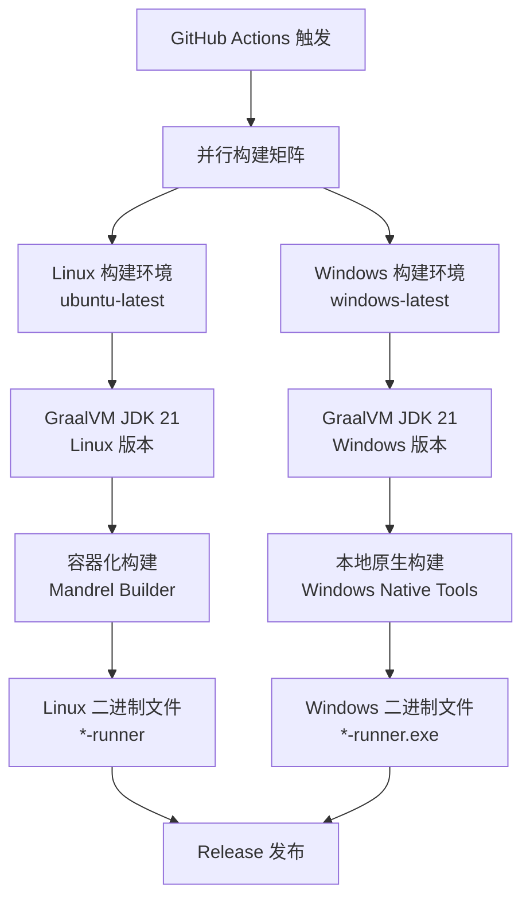
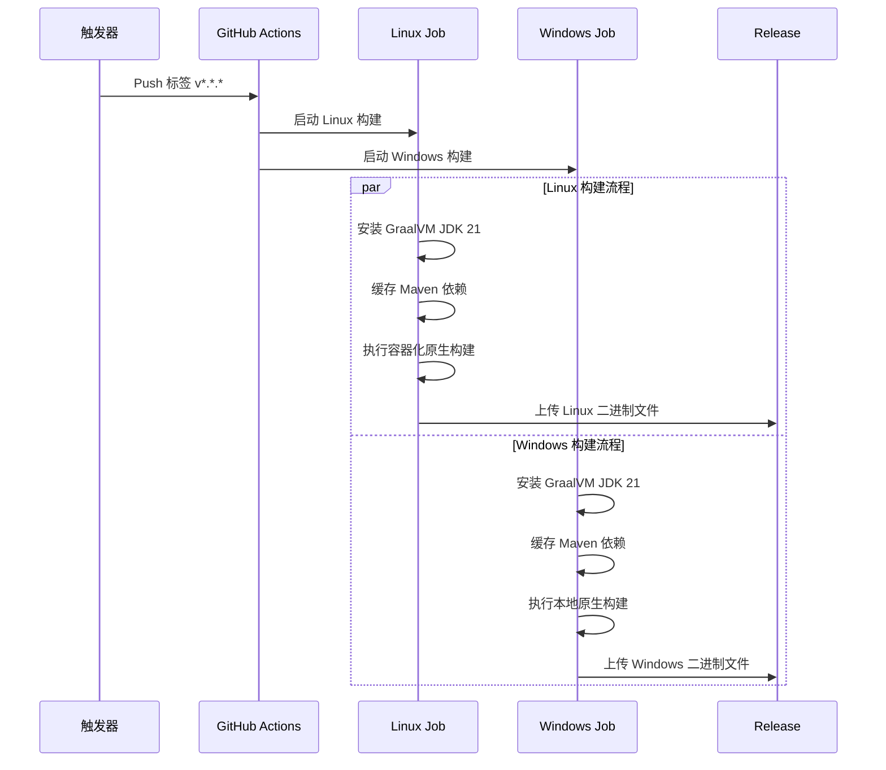

# Quarkus 项目 Windows 原生构建设计

## 概述

本设计文档描述了如何为现有的 Quarkus 项目在 GitHub Actions 中增加 Windows 原生二进制文件构建能力。项目当前已有基于 Ubuntu 的 Linux 原生构建流水线，我们将扩展构建能力以支持 Windows 平台的原生可执行文件生成。

### 设计目标

- 在现有 GitHub Actions 工作流中增加 Windows 原生构建任务
- 确保 Windows 和 Linux 构建能够并行执行，提高构建效率
- 生成可在 Windows 平台直接运行的原生可执行文件(.exe)
- 自动将构建产物上传到 GitHub Release

## 技术架构

### 构建环境架构



### 构建流程设计



## 完整的 GitHub Actions 配置示例

### 改进的 Windows 构建配置

以下是推荐的完整 GitHub Actions 工作流配置，解决了原有 `-Dquarkus.native.container-build=false` 的问题：

```yaml
name: Build Quarkus Native Image and Container

on:
  workflow_dispatch:
  push:
    tags:
      - 'v*.*.*' # 当推送版本标签时触发
      
permissions:
  contents: write

jobs:
  build-and-package-native:
    runs-on: ubuntu-latest
    steps:
      - name: Checkout code
        uses: actions/checkout@v4

      - name: Set up GraalVM
        uses: graalvm/setup-graalvm@v1
        with:
          java-version: '21'
          distribution: 'graalvm-community'
          github-token: ${{ secrets.GITHUB_TOKEN }}

      - name: Cache Maven dependencies
        uses: actions/cache@v4
        with:
          path: ~/.m2
          key: ${{ runner.os }}-m2-${{ hashFiles('**/pom.xml') }}
          restore-keys: ${{ runner.os }}-m2

      - name: chmod
        run: chmod +x ./mvnw

      - name: Build with Maven (compile)
        run: ./mvnw clean compile

      - name: Build native image
        run: ./mvnw package -Pnative -DskipTests -Dquarkus.native.container-build=true

      - name: Upload native binary to Release
        uses: softprops/action-gh-release@v1
        if: startsWith(github.ref, 'refs/tags/')
        with:
          files: target/*-runner
        env:
          GITHUB_TOKEN: ${{ secrets.GITHUB_TOKEN }}

  build-windows-native:
    runs-on: windows-latest
    steps:
      - name: Checkout code
        uses: actions/checkout@v4

      - name: Set up GraalVM
        id: setup-graalvm
        uses: graalvm/setup-graalvm@v1
        with:
          java-version: '21'
          distribution: 'graalvm-community'
          github-token: ${{ secrets.GITHUB_TOKEN }}

      - name: Cache Maven dependencies
        uses: actions/cache@v4
        with:
          path: ~/.m2
          key: ${{ runner.os }}-m2-${{ hashFiles('**/pom.xml') }}
          restore-keys: ${{ runner.os }}-m2

      - name: Setup MSVC
        uses: microsoft/setup-msbuild@v1

      - name: Build with Maven (compile)
        run: ./mvnw.cmd clean compile

      - name: Build Windows native image with MSVC
        shell: cmd
        run: |
          call "C:\Program Files\Microsoft Visual Studio\2022\Enterprise\VC\Auxiliary\Build\vcvars64.bat"
          ./mvnw.cmd package -Pnative -DskipTests -Dquarkus.native.additional-build-args=--verbose
        env:
          GRAALVM_HOME: ${{ steps.setup-graalvm.outputs.graalvm-home }}
          JAVA_HOME: ${{ steps.setup-graalvm.outputs.graalvm-home }}

      - name: Upload Windows native binary to Release
        uses: softprops/action-gh-release@v1
        if: startsWith(github.ref, 'refs/tags/')
        with:
          files: target/*-runner.exe
        env:
          GITHUB_TOKEN: ${{ secrets.GITHUB_TOKEN }}
```

### 关键改进点

1. **移除问题参数**: 不再使用 `-Dquarkus.native.container-build=false`
2. **添加 MSVC 支持**: 使用 `microsoft/setup-msbuild@v1` 确保 Visual Studio 工具可用
3. **环境变量设置**: 正确设置 `GRAALVM_HOME` 和 `JAVA_HOME`
4. **详细日志**: 添加 `--verbose` 参数便于调试
5. **Shell 指定**: 使用 `shell: cmd` 确保在 Windows 命令提示符下执行

### 替代方案配置

如果上述配置仍有问题，可以尝试以下替代方案：

#### 方案一：使用环境变量强制配置
```yaml
- name: Build Windows native image (Alternative)
  run: ./mvnw.cmd package -Pnative -DskipTests
  env:
    GRAALVM_HOME: ${{ steps.setup-graalvm.outputs.graalvm-home }}
    JAVA_HOME: ${{ steps.setup-graalvm.outputs.graalvm-home }}
    QUARKUS_NATIVE_CONTAINER_BUILD: false
    QUARKUS_NATIVE_BUILDER_IMAGE: ""
```

#### 方案二：使用 PowerShell 脚本
```yaml
- name: Build Windows native image (PowerShell)
  run: |
    $env:GRAALVM_HOME = "${{ steps.setup-graalvm.outputs.graalvm-home }}"
    $env:JAVA_HOME = "${{ steps.setup-graalvm.outputs.graalvm-home }}"
    & .\mvnw.cmd package -Pnative -DskipTests -Dquarkus.native.additional-build-args="--verbose"
  shell: powershell
```

## GitHub Actions 工作流配置

### 现有配置分析

项目当前的 `native-build.yml` 工作流已包含两个主要任务：
- `build-and-package-native`: Linux 平台构建（ubuntu-latest）
- `build-windows-native`: Windows 平台构建（windows-latest）

### Windows 构建任务配置

Windows 原生构建任务的关键配置要点：

#### 1. 运行环境配置
- **运行器**: `windows-latest`
- **Java 环境**: GraalVM Community Edition JDK 21
- **构建工具**: Maven（使用 Windows 批处理脚本 `mvnw.cmd`）

#### 2. 构建配置参数

**问题解决方案**：原有的 `-Dquarkus.native.container-build=false` 参数存在问题，在 Windows 环境下可能导致构建失败，因为 GitHub Actions 的 Windows 运行器缺少必要的 Visual Studio 构建工具。

**新的解决方案**：
```yaml
# 推荐的 Windows 原生构建命令
./mvnw.cmd package -Pnative -DskipTests
```

**或者使用环境变量方式**：
```yaml
# 设置环境变量
env:
  GRAALVM_HOME: ${{ steps.setup-graalvm.outputs.graalvm-home }}
  JAVA_HOME: ${{ steps.setup-graalvm.outputs.graalvm-home }}
# 构建命令
run: |
  call "C:\Program Files\Microsoft Visual Studio\2022\Enterprise\VC\Auxiliary\Build\vcvars64.bat"
  ./mvnw.cmd package -Pnative -DskipTests -Dquarkus.native.additional-build-args=--verbose
```

**优化的构建配置**：
```yaml
# 最佳实践：使用 Microsoft Visual Studio 初始化
- name: Setup MSVC
  uses: microsoft/setup-msbuild@v1
  
- name: Build Windows native image
  shell: cmd
  run: |
    call "C:\Program Files\Microsoft Visual Studio\2022\Enterprise\VC\Auxiliary\Build\vcvars64.bat"
    ./mvnw.cmd package -Pnative -DskipTests
```

关键参数说明：
- `-Pnative`: 激活 Maven native profile
- `-DskipTests`: 跳过测试执行以加速构建
- 移除 `-Dquarkus.native.container-build=false`: 让 Quarkus 自动检测构建环境
- `--verbose`: 增加详细日志输出，便于调试

#### 3. 依赖缓存策略
使用 GitHub Actions Cache 缓存 Maven 依赖：
```yaml
path: ~/.m2
key: ${{ runner.os }}-m2-${{ hashFiles('**/pom.xml') }}
```

### Maven 配置支持

项目的 `pom.xml` 已配置了 `native` profile，支持原生构建：

```xml
<profile>
    <id>native</id>
    <properties>
        <quarkus.package.type>native</quarkus.package.type>
        <quarkus.native.enabled>true</quarkus.native.enabled>
        <quarkus.native.container-build>true</quarkus.native.container-build>
    </properties>
</profile>
```

## 构建产物管理

### 产物生成规则

| 平台 | 产物文件名 | 生成路径 | 上传条件 |
|------|------------|----------|----------|
| Linux | `demoquarkus-1.0-SNAPSHOT-runner` | `target/` | 标签推送 |
| Windows | `demoquarkus-1.0-SNAPSHOT-runner.exe` | `target/` | 标签推送 |

### 发布策略

- **触发条件**: 推送版本标签（格式：`v*.*.*`，如 `v1.0.0`）
- **发布方式**: 自动上传到 GitHub Release
- **权限要求**: `contents: write`

### 版本管理


## 平台差异处理

### Windows 与 Linux 构建差异

| 特性 | Windows | Linux |
|------|---------|-------|
| 构建环境 | windows-latest | ubuntu-latest |
| Maven 命令 | `./mvnw.cmd` | `./mvnw` |
| 原生构建方式 | 本地 GraalVM + MSVC | 容器化（Mandrel） |
| 可执行文件扩展名 | `.exe` | 无扩展名 |
| 系统依赖 | Visual Studio Build Tools | Docker 容器环境 |
| 构建工具链 | MSVC 编译器 | GCC/容器工具链 |
| 环境初始化 | 需要 vcvars64.bat | 无需特殊初始化 |

### 构建时间对比

预期构建时间（基于 Quarkus 项目特点）：
- **Windows 原生构建**: 5-8 分钟
- **Linux 容器构建**: 4-6 分钟
- **并行执行**: 总时间取决于较慢的任务

## 构建优化策略

### 缓存优化

1. **Maven 依赖缓存**
   - 使用 `actions/cache@v4`
   - 基于 `pom.xml` 文件哈希生成缓存键
   - 按操作系统分别缓存

2. **GraalVM 安装缓存**
   - 使用 `graalvm/setup-graalvm@v1` 内置缓存
   - 基于 Java 版本和分发版本缓存

### 构建加速

1. **跳过测试**: 使用 `-DskipTests` 参数
2. **并行构建**: Linux 和 Windows 任务并行执行
3. **条件执行**: 仅在标签推送时执行完整构建

## 错误处理与监控

### 常见构建错误

1. **Windows Visual Studio 工具链错误**
   - 症状：`native-image` 命令找不到编译器工具
   - 解决方案：使用 `microsoft/setup-msbuild` Action 或手动初始化 MSVC 环境
   - 错误示例：`Error: VC++ tools not found`
   
2. **容器构建配置冲突**
   - 症状：Windows 环境下使用 `container-build=false` 仍尝试 Docker 构建
   - 解决方案：移除该参数，让 Quarkus 自动检测构建环境
   
3. **GraalVM 路径配置错误**
   - 症状：`GRAALVM_HOME` 环境变量未正确设置
   - 解决方案：使用 `graalvm/setup-graalvm` Action 的输出值设置环境变量

4. **内存不足错误**
   - 症状：GraalVM 原生编译失败
   - 解决方案：添加 JVM 参数 `-Dquarkus.native.native-image-xmx=4g`

5. **依赖解析失败**
   - 症状：Maven 依赖下载失败
   - 解决方案：重试机制和缓存恢复

6. **权限错误**
   - 症状：无法上传 Release 文件
   - 解决方案：确保 `GITHUB_TOKEN` 权限正确

### 监控指标

- 构建成功率
- 构建时间趋势
- 产物大小对比
- 缓存命中率

## 测试策略

### 构建验证

1. **语法验证**: 工作流 YAML 语法检查
2. **构建测试**: 在多个标签版本下测试构建
3. **产物验证**: 确保生成的可执行文件可正常运行

### 测试用例

| 测试场景 | 预期结果 |
|----------|----------|
| 推送 v1.0.0 标签 | 触发并行构建，生成两个平台的二进制文件 |
| 普通代码推送 | 不触发构建（仅标签触发） |
| 构建失败 | 不创建 Release，构建状态显示失败 |

### 验证命令

Windows 平台验证：
```cmd
# 下载并运行 Windows 二进制文件
demoquarkus-1.0-SNAPSHOT-runner.exe
```

Linux 平台验证：
```bash
# 下载并运行 Linux 二进制文件
chmod +x demoquarkus-1.0-SNAPSHOT-runner
./demoquarkus-1.0-SNAPSHOT-runner
```

## 故障排查指南

### Windows 构建常见问题及解决方案

#### 问题 1: Visual Studio 工具链未找到
```
Error: VC++ tools not found
```
**解决方案**：
1. 确保使用 `microsoft/setup-msbuild@v1` Action
2. 手动初始化 MSVC 环境：
```yaml
- name: Initialize MSVC
  shell: cmd
  run: call "C:\Program Files\Microsoft Visual Studio\2022\Enterprise\VC\Auxiliary\Build\vcvars64.bat"
```

#### 问题 2: container-build 参数冲突
```
Error: Docker not available but container-build is enabled
```
**解决方案**：
1. 移除 `-Dquarkus.native.container-build=false` 参数
2. 让 Quarkus 自动检测构建环境
3. 或明确设置环境变量：
```yaml
env:
  QUARKUS_NATIVE_CONTAINER_BUILD: false
```

#### 问题 3: GraalVM 路径配置错误
```
Error: Could not find native-image executable
```
**解决方案**：
```yaml
- name: Verify GraalVM installation
  run: |
    echo "GraalVM Home: ${{ steps.setup-graalvm.outputs.graalvm-home }}"
    "${{ steps.setup-graalvm.outputs.graalvm-home }}\bin\native-image" --version
  shell: powershell
```

#### 问题 4: 内存不足
```
Error: java.lang.OutOfMemoryError
```
**解决方案**：
```yaml
- name: Build with increased memory
  run: ./mvnw.cmd package -Pnative -DskipTests -Dquarkus.native.native-image-xmx=6g
```

### 调试技巧

#### 启用详细日志
```yaml
- name: Build with verbose logging
  run: |
    ./mvnw.cmd package -Pnative -DskipTests \
      -Dquarkus.native.additional-build-args="--verbose,--no-fallback" \
      -Dquarkus.log.level=DEBUG
```

#### 验证环境配置
```yaml
- name: Debug environment
  run: |
    echo "Java Version:"
    java -version
    echo "GraalVM Version:"
    native-image --version
    echo "Environment Variables:"
    set | findstr GRAALVM
    set | findstr JAVA
  shell: cmd
```

#### 检查构建工具
```yaml
- name: Check build tools
  run: |
    where cl.exe
    where link.exe
    echo "MSVC Environment:"
    set | findstr "INCLUDE\|LIB\|LIBPATH"
  shell: cmd
```

### 性能优化建议

1. **并行构建**：确保 Linux 和 Windows 任务并行执行
2. **缓存优化**：有效利用 Maven 依赖缓存
3. **构建时间优化**：
   ```yaml
   - name: Fast native build
     run: |
       ./mvnw.cmd package -Pnative -DskipTests \
         -Dquarkus.native.additional-build-args="-J-Xmx6g,-march=native,--gc=G1" \
         -Dquarkus.native.enable-reports=false
   ```

### 验证构建产物

#### 检查文件大小和依赖
```yaml
- name: Verify build artifacts
  run: |
    dir target\*-runner.exe
    echo "File size:"
    for %i in (target\*-runner.exe) do echo %~zi bytes
  shell: cmd
  
- name: Test executable
  run: |
    target\demoquarkus-1.0-SNAPSHOT-runner.exe --help || echo "Executable test completed"
  shell: cmd
```

## 安全考虑

### 权限最小化

- 工作流仅授予必要的 `contents: write` 权限
- 使用 GitHub 提供的 `GITHUB_TOKEN`，避免自定义 Token

### 供应链安全

- 固定 Action 版本（如 `@v4`, `@v1`）
- 使用官方维护的 Actions
- 定期更新 Action 版本

## 部署与维护

### 部署步骤

1. **检查现有配置**
   - 确认工作流文件位置：`.github/workflows/native-build.yml`
   - 验证是否包含 Windows 构建任务
   - 检查是否存在 `-Dquarkus.native.container-build=false` 问题参数

2. **更新配置文件**
   ```bash
   # 备份原有配置
   cp .github/workflows/native-build.yml .github/workflows/native-build.yml.backup
   
   # 应用新的配置（根据上文提供的方案）
   # 修改 Windows 构建部分
   ```

3. **测试构建流程**
   ```bash
   # 创建测试标签并推送
   git tag v1.0.0-test
   git push origin v1.0.0-test
   ```

4. **监控构建结果**
   - 在 GitHub Actions 页面查看构建进度
   - 检查是否成功生成两个平台的二进制文件
   - 验证产物质量

### 维护指南

#### 1. 定期更新

**GraalVM 版本更新**：
```yaml
# 在 .github/workflows/native-build.yml 中更新
- name: Set up GraalVM
  uses: graalvm/setup-graalvm@v1
  with:
    java-version: '21'  # 更新到最新的 LTS 版本
    distribution: 'graalvm-community'
```

**GitHub Actions 版本更新**：
- `actions/checkout@v4` → 最新版本
- `actions/cache@v4` → 最新版本
- `softprops/action-gh-release@v1` → 最新版本

**Quarkus 平台版本更新**：
```xml
<!-- 在 pom.xml 中更新 -->
<quarkus.platform.version>3.25.4</quarkus.platform.version>
```

#### 2. 性能监控

**构建时间监控**：
```yaml
- name: Build time tracking
  run: |
    $start = Get-Date
    ./mvnw.cmd package -Pnative -DskipTests
    $end = Get-Date
    $duration = $end - $start
    echo "Build completed in: $($duration.TotalMinutes) minutes"
  shell: powershell
```

**产物大小监控**：
```yaml
- name: Artifact size tracking
  run: |
    $file = Get-ChildItem target\*-runner.exe | Select-Object -First 1
    $sizeKB = [math]::Round($file.Length / 1KB, 2)
    $sizeMB = [math]::Round($file.Length / 1MB, 2)
    echo "Executable size: $sizeKB KB ($sizeMB MB)"
  shell: powershell
```

#### 3. 故障排查

**自动化诊断脚本**：
```yaml
- name: Diagnostic information
  if: failure()
  run: |
    echo "=== Environment Information ==="
    echo "Java Version:"
    java -version
    echo "GraalVM Version:"
    native-image --version 2>nul || echo "native-image not found"
    echo "MSVC Tools:"
    where cl.exe 2>nul || echo "cl.exe not found"
    echo "Environment Variables:"
    set | findstr /I "graal\|java\|path" | sort
    echo "=== Build Logs ==="
    type target\native-image\*.log 2>nul || echo "No native-image logs found"
  shell: cmd
```

**日志收集**：
```yaml
- name: Upload build logs
  if: failure()
  uses: actions/upload-artifact@v3
  with:
    name: build-logs-windows
    path: |
      target/native-image/
      target/surefire-reports/
    retention-days: 7
```

#### 4. 安全维护

**定期安全扫描**：
```yaml
- name: Security scan
  run: |
    # 使用 Maven 依赖检查插件
    ./mvnw.cmd org.owasp:dependency-check-maven:check
```

**依赖更新监控**：
- 使用 Dependabot 自动更新依赖
- 定期检查 CVE 漏洞
- 监控 GraalVM 安全更新

