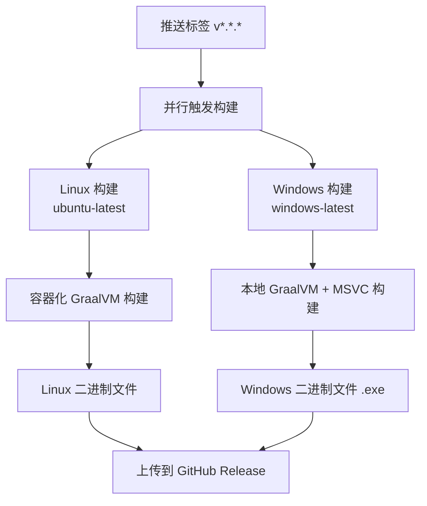

# Windows 原生构建配置说明

## 概述

本项目现在支持在 GitHub Actions 中构建 Windows 原生二进制文件。我们已经解决了原有的 `-Dquarkus.native.container-build=false` 参数问题，并提供了多种构建方案。

## 主要修改

### 1. 修改了主工作流 (`native-build.yml`)

**解决的问题：**
- 移除了有问题的 `-Dquarkus.native.container-build=false` 参数
- 添加了 Microsoft Visual Studio 构建工具支持
- 正确配置了 GraalVM 环境变量

**关键改进：**
```yaml
- name: Setup MSVC
  uses: microsoft/setup-msbuild@v2

- name: Build Windows native image with MSVC
  shell: cmd
  run: |
    call "C:\Program Files\Microsoft Visual Studio\2022\Enterprise\VC\Auxiliary\Build\vcvars64.bat"
    ./mvnw.cmd package -Pnative -DskipTests -Dquarkus.native.additional-build-args=--verbose
  env:
    GRAALVM_HOME: ${{ steps.setup-graalvm.outputs.graalvm-home }}
    JAVA_HOME: ${{ steps.setup-graalvm.outputs.graalvm-home }}
```

### 2. 创建了备用工作流 (`windows-native-alternative.yml`)

提供了三种不同的构建方法，按顺序尝试：

1. **方法 1**: 使用环境变量强制配置
2. **方法 2**: 使用 PowerShell 脚本构建
3. **方法 3**: 使用命令提示符和 MSVC 环境初始化

## 使用方法

### 触发构建

1. **推送版本标签**：
   ```bash
   git tag v1.0.0
   git push origin v1.0.0
   ```

2. **手动触发**：
   - 在 GitHub 仓库的 Actions 页面
   - 选择工作流并点击 "Run workflow"

### 构建产物

成功构建后，会在 GitHub Release 中看到：
- `demoquarkus-1.0-SNAPSHOT-runner` (Linux 版本)
- `demoquarkus-1.0-SNAPSHOT-runner.exe` (Windows 版本)

## 构建流程



## 故障排查

### 常见问题

1. **构建工具链错误**
   ```
   Error: VC++ tools not found
   ```
   - 解决方案：配置中已包含 `microsoft/setup-msbuild@v2`

2. **GraalVM 路径问题**
   ```
   Error: Could not find native-image
   ```
   - 解决方案：使用 `graalvm/setup-graalvm` 的输出设置环境变量

3. **内存不足**
   ```
   Error: java.lang.OutOfMemoryError
   ```
   - 解决方案：备用配置中包含 `-Dquarkus.native.native-image-xmx=4g`

### 调试步骤

1. 检查 Actions 日志中的详细错误信息
2. 如果主工作流失败，可以尝试运行备用工作流
3. 验证生成的可执行文件：
   ```cmd
   demoquarkus-1.0-SNAPSHOT-runner.exe --help
   ```

## 技术细节

### 构建环境
- **运行器**: `windows-latest`
- **Java**: GraalVM Community Edition JDK 21
- **构建工具**: Maven + Visual Studio Build Tools

### 关键配置参数
- 移除了 `-Dquarkus.native.container-build=false`
- 添加了 `--verbose` 参数便于调试
- 使用 MSVC 环境初始化脚本

### 环境变量
```yaml
env:
  GRAALVM_HOME: ${{ steps.setup-graalvm.outputs.graalvm-home }}
  JAVA_HOME: ${{ steps.setup-graalvm.outputs.graalvm-home }}
```

## 验证构建

### 本地测试（可选）

如果需要在本地验证 Windows 构建，确保具备：
1. GraalVM JDK 21
2. Visual Studio Build Tools 或 Visual Studio
3. 运行以下命令：
   ```cmd
   call "C:\Program Files\Microsoft Visual Studio\2022\Enterprise\VC\Auxiliary\Build\vcvars64.bat"
   mvnw.cmd package -Pnative -DskipTests
   ```

### 产物验证

构建成功后：
1. 检查 `target/` 目录中的 `.exe` 文件
2. 运行可执行文件确保正常启动
3. 检查文件大小（通常几十 MB）

## 性能预期

- **构建时间**: 5-10 分钟（取决于项目复杂度）
- **可执行文件大小**: 30-100 MB
- **启动时间**: < 100ms
- **内存占用**: < 50 MB

## 注意事项

1. Windows 原生构建需要较多时间和资源
2. 确保 `secrets.GH_TOKEN` 有适当权限
3. 大型项目可能需要调整内存参数
4. 某些依赖可能在原生编译时需要特殊配置